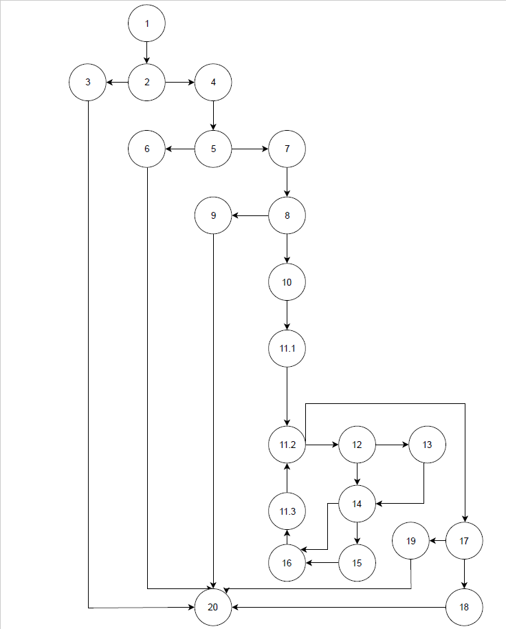

# Втора лабораториска вежба по Софтверско инженерство

## Филип Ангелов, бр. на индеџ 183008

## Група на код: 2

## Control Flow Graph

## Циколматска комплексонст 
Цикломатската комплексност на овој Control Flow Graph е 8, истата е добиена 
преку трите формули:
1. R = 8
2. E - N + 2 = 28 - 22 + 2 = 8
3. P + 1 = 7 + 1 = 8
## Тест случаи според критериумот Every path и Every branch
1. user = null, allUsers = new List()
2. user = (null, null,  null), allUsers = new List()
3. user = (Filip, null,  null), allUsers = new List()
4. user = (Filip, null,  emy.c), allUsers = new List()
5. user = (Filip, null,  em@yc), allUsers = new List()
6. user = (Filip, null,  em2@y.c), allUsers = new List()

## Објаснување на напишаните unit test
1. кога корисникот не е инцијализиран програмата треба да фрли исклучок
2. кога името на корисникот не е поставено или веке е постоечко во листата на
корисници, треба да фрли исклучок, подетални тестови за овој if услов со
повеќе проверки се направени во multipleConditionTest
3. корисникот сега има поставено име, но нема поставено е-маил, функцијата ќе
врати false
4. корисникот има поставено име и е-маил но не валиден, функцијата ќе врати false
5. корисникот има поставено име и е-маил но повторно не валиден, функцијата ќе врати false
6. корисникот има поставено име и е-маил валиден, функцијата ќе врати true

## If со повеќе услови
1. првиот услов е точен, ќе се фрли исклучок
2. првиот услов е неточен а вториот точен, ќе се фрли исклучок
3. двата услова се неточни, не се фрла искчучок 
